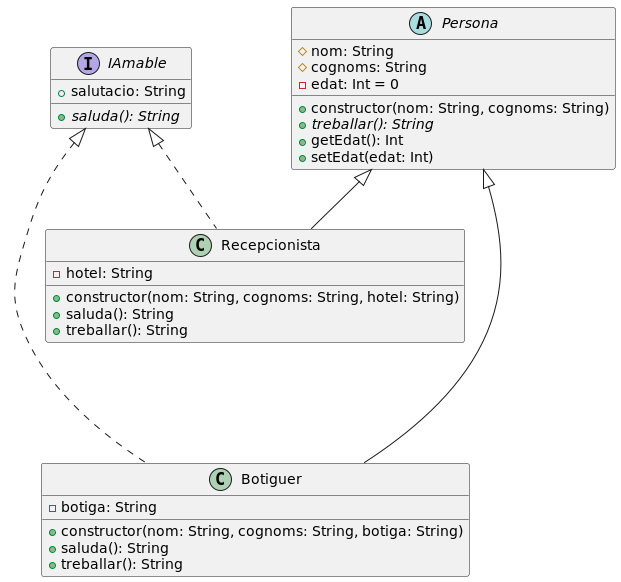

# Contingut
Projecte d'exemple amb propòsit didàctic tal per il·lustrar la sintaxi i ús de les **interfaces** en llenguatge **kotlin** per **multiplataforma**

# IDE
IntelliJ IDEA

# Diagrama de classes

> [!NOTE]
> Diagrama realitzat amb el plugin [**PlantUML Integration**](https://plugins.jetbrains.com/plugin/7017-plantuml-integration) per IntelliJ
